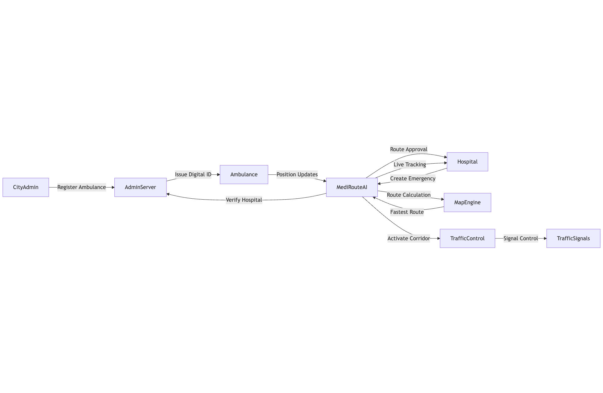
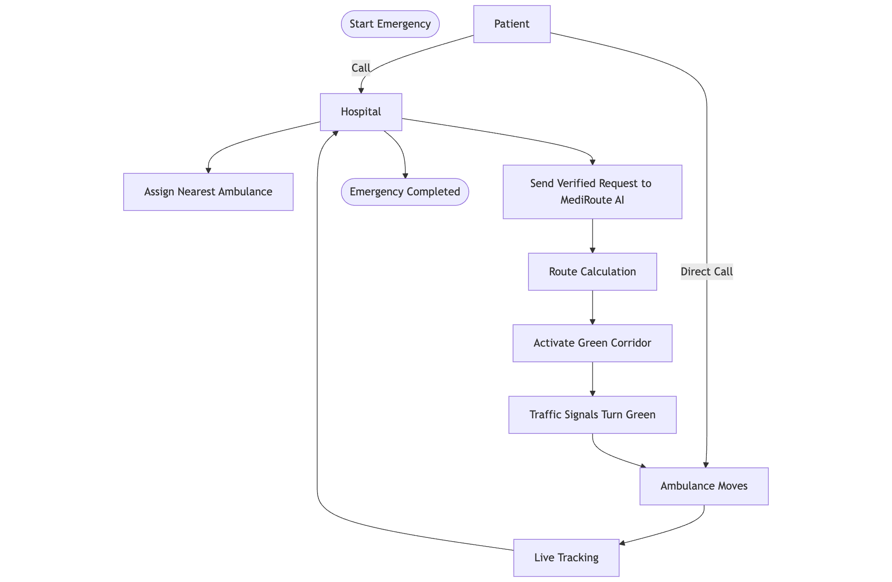

# 🚑 MediRoute AI – Smart Ambulance Navigation System

> ⏱ Every 1 minute of delay in emergency response reduces survival probability by **7-10%**.  
> **MediRoute AI** minimizes delays by automating routing, traffic control, and hospital coordination in real time.

---

## 🧠 Overview

**MediRoute AI** is a real-time, city-scale emergency mobility platform that coordinates:

- 🚑 **Ambulances**
- 🏥 **Hospitals** 
- 🚦 **Traffic signals**

to create **automated green corridors**, dynamically assign **optimal hospitals**, and provide **city-level administrative control**, saving critical minutes and lives.

---

## 🚀 Real-World Impact

| Impact | Benefit |
|--------|---------|
| ⏱ Reduced response time | 25-40% faster ambulance arrival |
| 🏥 Prevents hospital overload | Smart ICU & ER load balancing |
| 🚦 Clears traffic congestion | Automated green corridors |
| ❤️ Saves critical minutes | Higher survival probability |
| 🏙 Smart-city ready | Scalable city-wide deployment |

---

## 🏗️ Architecture



**Core Components:**
- **CityAdmin**: Ambulance registration & fleet oversight
- **AdminServer**: Authentication & verification
- **Ambulance**: Real-time GPS tracking & response
- **Hospital**: Emergency management & coordination
- **MediRouteAI Core**: Route optimization & traffic control
- **MapEngine**: Route calculation & navigation
- **TrafficControl**: Automated signal management
- **TrafficSignals**: Physical infrastructure integration

---

## 🏗️ Basic System Logical Data Flow Diagram

MediRoute AI follows a centrally controlled, hospital‑approved emergency mobility workflow.


### 🚨 Emergency Entry Points
| Actor | Action |
|-----|-------|
| Patient / Emergency Caller | Calls hospital emergency |
| Hospital Control Staff| Creates emergency request |
| Ambulance Driver | Can directly create emergency via MediRoute App |
| City Admin | Can initiate or monitor emergencies |

---

### 🏥 Verification & Approval Layer
| Component | Responsibility |
|----------|---------------|
| Hospital Control Unit | Approves or rejects emergency requests |
| Admin Command Center | City‑wide supervision & override control |

---

### 🧠 Core Decision Layer
| Engine | Function |
|------|--------|
| MediRoute Core System | Central brain coordinating all operations |
| Hospital Control Unit | Selects best hospital based on ICU, beds, load |
| Route Engine | Calculates fastest traffic‑aware route |
| Map Engine | Provides navigation & road data |
| MediBot AI Nurse | Gives first‑aid and medical guidance |

---

### ⚙️ Execution Layer
| Component | Action |
|---------|------|
| MediRoute App | Displays live route, ETA, MediBot instructions |
| Traffic Signal Controller | Activates green corridor |
| City Traffic Signals | Turn green automatically for ambulance |

---

### 🗄 Realtime Data Layer
| System | Purpose |
|------|------|
| Supabase Realtime Database | Stores emergencies, GPS, beds, ETAs |
| Hospital Control Unit | Updates hospital readiness |
| Admin Command Center | Monitors city‑wide emergency status |

---

### 🔁 End‑to‑End Flow Summary
1. Emergency is raised by Patient / Driver / Admin  
2. Hospital Control Unit verifies and approves  
3. MediRoute Core processes the emergency  
4. Best hospital is selected automatically  
5. Fastest route is calculated  
6. Green corridor is activated  
7. Ambulance is guided in real time  
8. Hospital prepares before arrival  
9. After arrival, emergency closes and signals reset  

---

## 🔄 Workflow



**Streamlined Process:**
1. **Emergency Initiation** - Patient calls hospital/services
2. **Hospital Response** - Verifies & assigns nearest ambulance
3. **Route Calculation** - AI optimizes considering traffic
4. **Green Corridor** - Automatic traffic signal priority
5. **Live Tracking** - Real-time updates to all parties
6. **Completion** - Arrival confirmation & system reset

---

## 🏥 Hospital Logic

- Hospital assignment computed dynamically using:

  **Hospital Score =**
  - Distance Weight
  - Available ICU Beds
  - Emergency Beds
  - Incoming Ambulances Penalty

- Hospital with **lowest score** automatically selected to:
  - Minimize patient transport time
  - Prevent hospital overcrowding
  - Balance ICU/emergency load
  - Improve survival outcomes

---

## 🚑 Features

- Real-time ambulance GPS tracking
- Automated traffic signal priority
- Dual-phase routing (patient → hospital)
- Multi-role dashboards
- Emergency token system
- Live route recalculation
- Hospital ETA synchronization

---

## 🤖 MediBot

**AI-powered emergency nurse** integrated into MediRoute AI.

**Capabilities:**
- Step-by-step life-saving instructions
- No long explanations
- Strict medical action formatting
- Works before hospital arrival
- **Gemini-powered backend**

**Purpose:** On-scene triage during critical minutes.

---

## 🧑‍💼 Admin Center

### City-Level Control
- System ON/OFF
- Emergency broadcast
- Manual green corridor override
- Zone-based signal locking

### Ambulance Fleet
- Register/approve/disable ambulances
- Force emergency mode
- Live fleet tracking
- Manual hospital assignment

### Traffic Signals
- Turn signals GREEN/RED
- Corridor duration control
- Signal health monitoring

### Hospitals
- ICU/emergency bed management
- Mark hospital FULL
- Load balancing analytics

### Analytics
- Average response time
- Active green corridors
- Hospital occupancy
- Estimated lives saved

---

## 🛠 Tech Stack

| Layer | Technology |
|-------|------------|
| Frontend | React 18, TypeScript, Tailwind |
| UI | shadcn/ui, Radix UI |
| Maps | Leaflet, React-Leaflet |
| Backend | Supabase (Postgres, Auth, Realtime) |
| AI | Gemini API |
| Deployment | Vercel |
| Build Tool | Vite |

---

## ⚡ Scalability

- Multi-city deployment ready
- Supports 1000+ ambulances
- Sub-second real-time updates
- Expandable traffic signal grid
- Cloud-native & edge-ready

---

## 🚀 Quick Start

### Prerequisites
- Node.js 18+ and npm
- Supabase account
- Vercel account

### Installation

1. **Clone repository**
   ```bash
   git clone https://github.com/puneetkumargarg/mediroute-ai.git
   cd mediroute-ai
   ```

2. **Install dependencies**
   ```bash
   npm install --legacy-peer-deps
   ```

3. **Environment Setup**
   ✅ Create `.env.local` in root directory
   ```env
   VITE_SUPABASE_PROJECT_ID="your-project-id"
   VITE_SUPABASE_PUBLISHABLE_KEY="your-anon-key"
   VITE_SUPABASE_URL="https://your-project-id.supabase.co"
   ```

4. **Database Setup**
   - Create a new Supabase project
   - Run the migrations in the `supabase/migrations/` folder
   - Or use Supabase CLI:
     ```bash
     supabase link --project-ref your-project-id
     supabase db push
     ```

5. **Start Development Server**
   ```bash
   npm run dev
   ```

## 📱 User Roles

### 🚑 Ambulance Driver
- Real-time location tracking
- Emergency status management
- Route navigation with traffic signal priority
- Hospital destination selection

### 🏥 Hospital Staff
- Monitor incoming ambulances
- View real-time ETAs
- Emergency request management
- Patient preparation coordination

### 👨‍💼 Administrator
- Manage ambulance fleet
- Driver registration and approval
- System monitoring and analytics
- Traffic signal configuration

## 🗄️ Database Schema

### Core Tables
- `profiles` - User profiles with role-based access
- `ambulances` - Ambulance fleet management
- `emergency_tokens` - Emergency request tracking
- `hospitals` - Hospital information
- `traffic_signals` - Traffic signal locations and status

## 🌐 Deployment

### Vercel Deployment

1. **Connect to Vercel**
   ```bash
   npm install -g vercel
   vercel login
   vercel --prod
   ```

2. **Environment Variables**
   Add these in Vercel dashboard:
   - `VITE_SUPABASE_PROJECT_ID`
   - `VITE_SUPABASE_PUBLISHABLE_KEY`
   - `VITE_SUPABASE_URL`

3. **Domain Configuration**
   - Set your Vercel domain in Supabase Auth settings
   - Configure redirect URLs for authentication

## 🔧 Development

### Available Scripts

```bash
npm run dev          # Start development server
npm run build        # Build for production
npm run preview      # Preview production build
npm run lint         # Run ESLint
```

### Project Structure

```
src/
├── components/          # Reusable UI components
│   ├── ui/             # shadcn/ui components
│   └── ...             # Custom components
├── hooks/              # Custom React hooks
├── pages/              # Page components
├── types/              # TypeScript type definitions
├── integrations/       # External service integrations
└── lib/                # Utility functions
```

## 🔐 Authentication

The system uses Supabase Auth with role-based access control:

- **Email/Password Authentication**
- **Role-based Routing**
- **Protected Routes**
- **Session Management**

## 🗺️ Maps Integration

- **Leaflet** for interactive maps
- **Real-time Location Updates**
- **Route Visualization**
- **Traffic Signal Markers**
- **Hospital Locations**

## 🚨 Emergency Workflow

The system follows an intelligent emergency response process:

### Phase 1: Emergency Initiation
- Patient calls hospital or directly contacts emergency services
- Hospital staff verify the emergency and assess severity
- System identifies nearest available ambulance

### Phase 2: Route Optimization
- MediRoute AI calculates optimal route using real-time traffic data
- Multiple route options generated considering:
  - Current traffic conditions
  - Road closures and construction
  - Hospital capacity and specialization
  - Ambulance location and availability

### Phase 3: Green Corridor Activation
- Traffic signals along the route automatically receive priority commands
- Signals turn green in sequence as ambulance approaches
- Real-time coordination with traffic management systems

### Phase 4: Live Tracking & Updates
- Continuous GPS tracking of ambulance location
- Real-time ETA updates sent to hospital
- Patient/family notifications with progress updates
- Route adjustments based on changing conditions

### Phase 5: Completion & Reset
- System confirms ambulance arrival at hospital
- Traffic signals return to normal operation
- Emergency token marked as completed
- Performance metrics logged for analysis

## 🚀 Scalability & Fault Tolerance

MediRoute AI is designed as a **cloud‑native, city‑grade emergency mobility platform** that can safely grow across cities while avoiding system failures.

---

### 📈 Handling Growth (Scalability)

#### 1️⃣ City‑Wise Logical Isolation
Each city runs as an independent logical unit:
- Separate hospitals, ambulances, and traffic grids  
- New cities can be added without affecting existing deployments

---

#### 2️⃣ Realtime Database Scaling (Supabase)
- Handles thousands of concurrent GPS streams  
- Sub‑second realtime updates  
- Automatic indexing and partitioning  

Supports **1000+ ambulances streaming every 2 seconds**.

---

#### 3️⃣ Stateless Core Services
MediRoute Core services are stateless:
- Any request can go to any server instance  
- Vercel auto‑scales horizontally  
- No single server becomes a bottleneck

---

#### 4️⃣ Modular Micro‑Service Design

| Module | Independent Scaling |
|-------|---------------------|
| Route Engine | Yes |
| Hospital Allocation AI | Yes |
| Traffic Signal Controller | Yes |
| MediBot AI Nurse | Yes |

Each heavy module scales independently based on load.

---

### 🛡️ Avoiding Failures (Fault Tolerance)

#### 1️⃣ No Single Point of Failure
- All emergency state stored in Supabase  
- If one server crashes, another instantly takes over

---

#### 2️⃣ Live Health Monitoring
The system monitors:
- Ambulance GPS heartbeat  
- Traffic signal responses  
- Hospital availability  

Auto‑recovery is triggered if any component fails.

---

#### 3️⃣ Safe Fallback Modes

| Failure Scenario | Automatic System Action |
|-----------------|------------------------|
| Traffic API down | Route recalculated using normal roads |
| Hospital overloaded | Next best hospital auto‑assigned |
| GPS signal lost | Last known location used + driver alert |
| Network outage | Manual mode enabled |

---

#### 4️⃣ Human Override Layer
Admins can:
- Pause green corridors  
- Manually assign hospitals  
- Disable faulty traffic signals  

This ensures a human safety layer above AI.

---

#### 5️⃣ Data Durability & Recovery
- Automatic backups & replication  
- Emergency states auto‑restored  
- Zero data loss guarantee

> **MediRoute AI uses cloud auto‑scaling, realtime replication, stateless services, and human override layers to ensure zero downtime emergency operations across cities.**

---

## 🤝 Contributing

1. Fork the repository
2. Create a feature branch (`git checkout -b feature/amazing-feature`)
3. Commit your changes (`git commit -m 'Add amazing feature'`)
4. Push to the branch (`git push origin feature/amazing-feature`)
5. Open a Pull Request

## 📄 License

This project is licensed under the MIT License - see the [LICENSE](LICENSE) file for details.


## 🙏 Acknowledgments

- Emergency services for inspiration
- Open source mapping communities
- Healthcare technology innovators

---

**MediRoute AI** - Saving lives through smart technology 🚑
